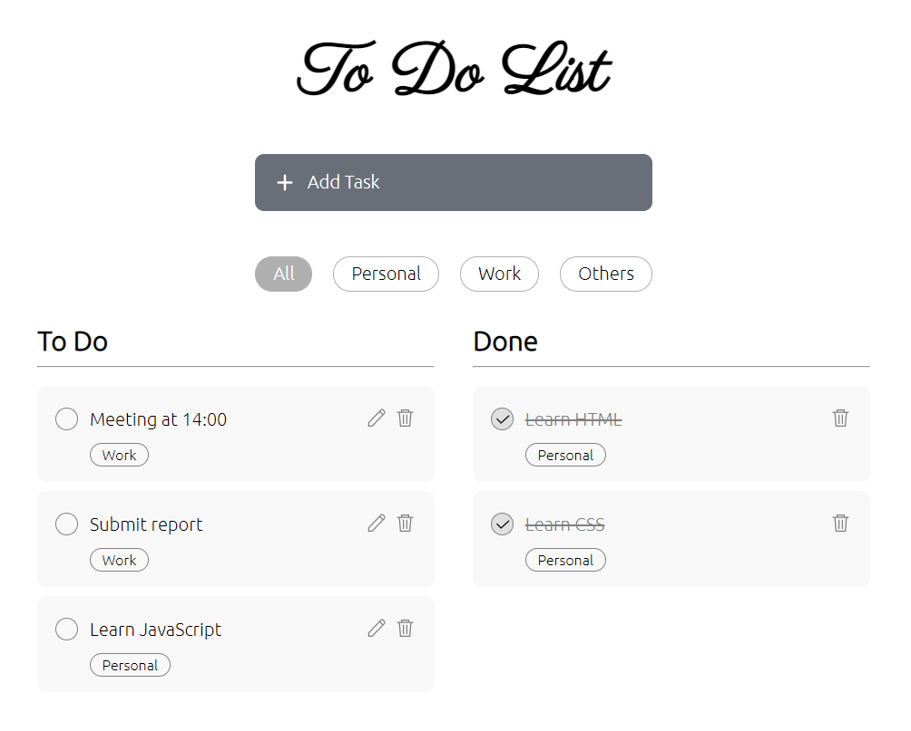

# To Do List

This is a simple to do list developed in Vanilla JavaScript. It has the following features:
- Label tasks with a preset tag
- Select tag tab to show tasks with a specific tag
- Delete and edit created tasks 
- LocalStorage to store data in the browser

Demo: [https://martyjan.github.io/toDoList/](https://martyjan.github.io/toDoList/)

